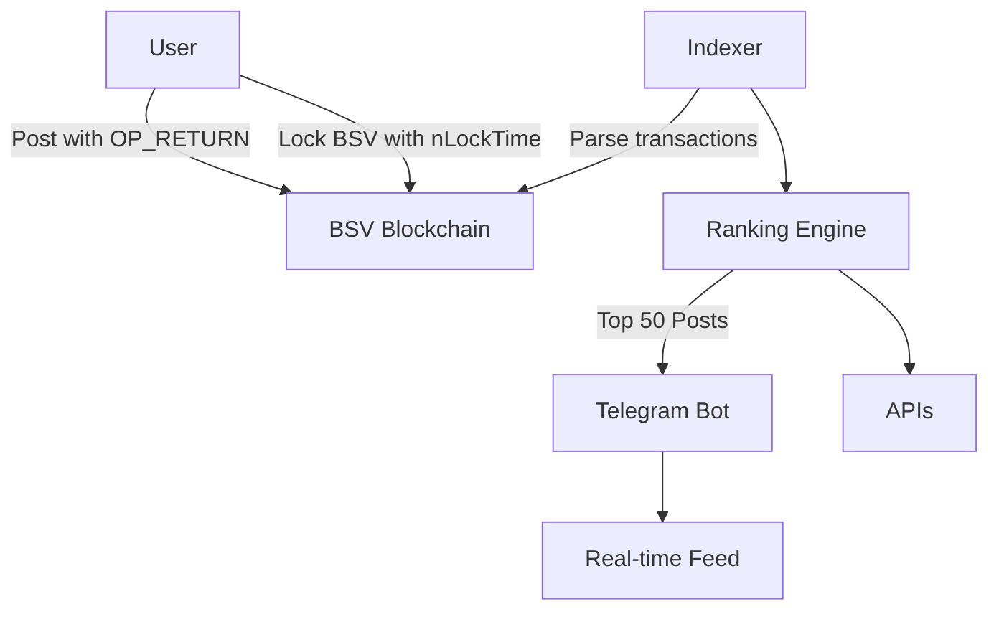

# Lockd.app

A decentralized platform for sharing and locking posts on the Bitcoin SV blockchain.

## Features

- Create and share posts
- Lock BSV to posts
- Real-time post updates
- BSV wallet integration
- Modern, responsive UI

## Tech Stack

- React
- TypeScript
- Vite
- Supabase
- TailwindCSS

## Getting Started

### Prerequisites

- Node.js (v18+)
- npm or yarn
- A Supabase account and project

### Installation

1. Clone the repository:
```bash
git clone https://github.com/yourusername/lockd.app.git
cd lockd.app
```

2. Install dependencies:
```bash
npm install
```

3. Create a `.env` file in the root directory and add your Supabase credentials:
```env
VITE_SUPABASE_URL=your_supabase_url
VITE_SUPABASE_ANON_KEY=your_supabase_anon_key
```

4. Start the development server:
```bash
npm run dev
```

The app will be available at `http://localhost:3000`.

## Database Setup

Run the following SQL commands in your Supabase SQL editor to set up the database schema:

```sql
-- Create creators table
CREATE TABLE IF NOT EXISTS creators (
  handle TEXT PRIMARY KEY,
  created_at TIMESTAMP WITH TIME ZONE DEFAULT TIMEZONE('utc', NOW())
);

-- Create posts table
CREATE TABLE IF NOT EXISTS posts (
  txid TEXT PRIMARY KEY,
  amount BIGINT NOT NULL,
  content TEXT NOT NULL,
  media_url TEXT,
  locked_until BIGINT NOT NULL,
  handle_id TEXT NOT NULL REFERENCES creators(handle),
  created_at TIMESTAMP WITH TIME ZONE DEFAULT TIMEZONE('utc', NOW())
);

-- Create locklikes table
CREATE TABLE IF NOT EXISTS locklikes (
  txid TEXT PRIMARY KEY,
  post_txid TEXT NOT NULL REFERENCES posts(txid),
  amount BIGINT NOT NULL,
  locked_until BIGINT NOT NULL,
  created_at TIMESTAMP WITH TIME ZONE DEFAULT TIMEZONE('utc', NOW())
);

-- Create indexes
CREATE INDEX IF NOT EXISTS posts_handle_id_idx ON posts(handle_id);
CREATE INDEX IF NOT EXISTS locklikes_post_txid_idx ON locklikes(post_txid);
CREATE INDEX IF NOT EXISTS posts_created_at_idx ON posts(created_at DESC);

-- Insert default 'anon' creator
INSERT INTO creators (handle) 
VALUES ('anon')
ON CONFLICT (handle) DO NOTHING;
```

## Contributing

1. Fork the repository
2. Create your feature branch (`git checkout -b feature/amazing-feature`)
3. Commit your changes (`git commit -m 'Add some amazing feature'`)
4. Push to the branch (`git push origin feature/amazing-feature`)
5. Open a Pull Request

## License

This project is licensed under the MIT License - see the [LICENSE](LICENSE) file for details.


## 🚀 Key Features
- Post Anonymously: No accounts. Submit links/text via BSV OP_RETURN.
- Lock BSV as Signal: Use nLockTime to stake on posts you believe in.
- Dynamic Truth Feed: Live rankings sorted by locked BSV (0.001% platform fee).
- Telegram Integration: Real-time updates of top locked narratives.
- Scrypt Smart Contracts: Secure, auditable locking logic on-chain.

## ⚙️ How It Works
1. Post Content
```typescript
// Submit post via BSV transaction
async function submitPost(content: string) {
  const tx = await bsv.sendPayment({
    from: 'burner', // Anonymous
    opReturn: ['Z_POST', content]
  });
  return tx.id; // post_id = TX hash
}
```

// Example OP_RETURN: Z_POST|https://news.com/earthquake
```typescript
2. Lock BSV to Signal Value
// Lock BSV for 10 minutes to boost a post
async function lockBSV(postId: string, amount: number) {
  const fee = amount * 0.000001; // 0.0001% fee
  const lockTime = Math.floor(Date.now() / 1000) + 600; // 10 min

  const contract = new sCrypt.Contract(`
    // Locking contract with nLockTime
    @method
    public function unlock() {
      require(tx.time >= ${lockTime});
    }
  `);

  const tx = await contract.lock(amount - fee)
    .to(postId) // Link lock to post
    .withFee(fee)
    .execute();

  return tx.id;
}
```
3. Dynamic Feed Algorithm
```typescript
// Calculate post rankings every block 
function calculateRankings(posts: Post[]) {
  return posts.sort((a, b) => {
    return b.totalLocked - a.totalLocked; // Descending
  });
}
```
// Telegram Bot Update
```
async function updateChannel() {
  const topPosts = await fetchRankedPosts();
  const message = topPosts.map((post, i) => 
    `${i+1}. [${post.lockedBSV} BSV] ${post.content}`
  ).join('\n');

  await bot.telegram.editMessageText(
    CHANNEL_ID, 
    LAST_MESSAGE_ID,
    undefined, 
    `🔴 LIVE ZEITGEIST RANKINGS:\n\n${message}`
  );
}
```

## 🏗 Architecture


## Blockchain Layer
- Posts: OP_RETURN with Z_POST|content
- Locks: P2SH transactions with nLockTime (10 minutes)

## Indexer
- Tracks Z_POST transactions and linked locks
- Aggregates total locked BSV per post

## Ranking Engine
- Sorts posts by locked BSV, updates every block

## Telegram Frontend
- Auto-updating channel with latest rankings
