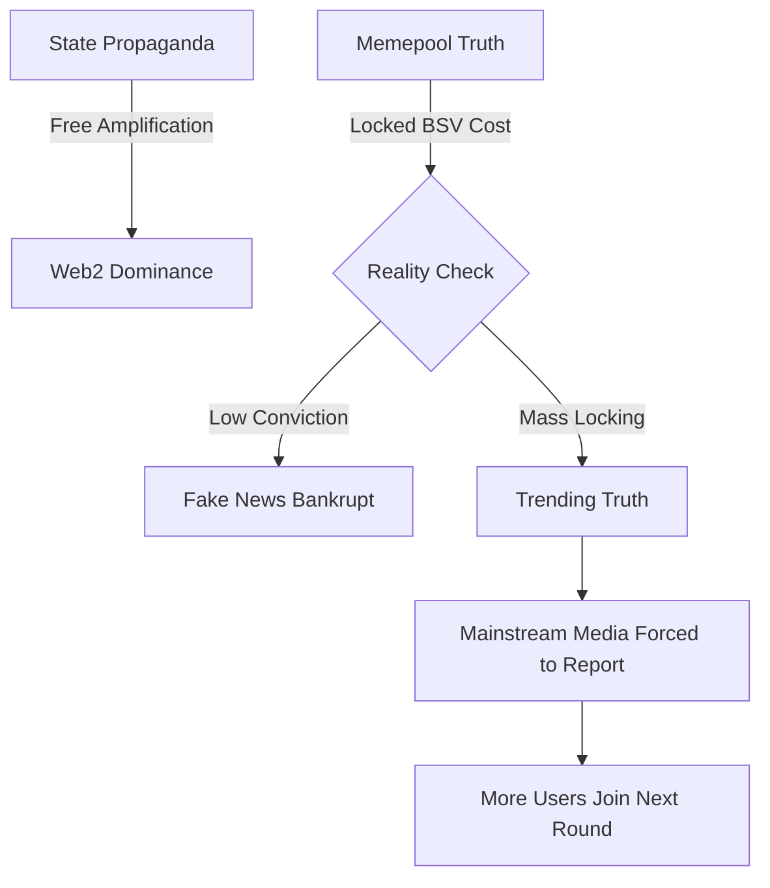
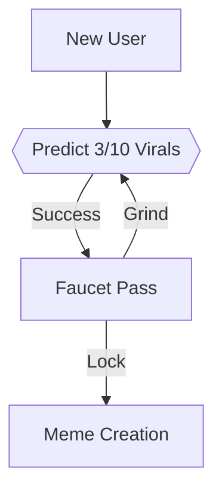
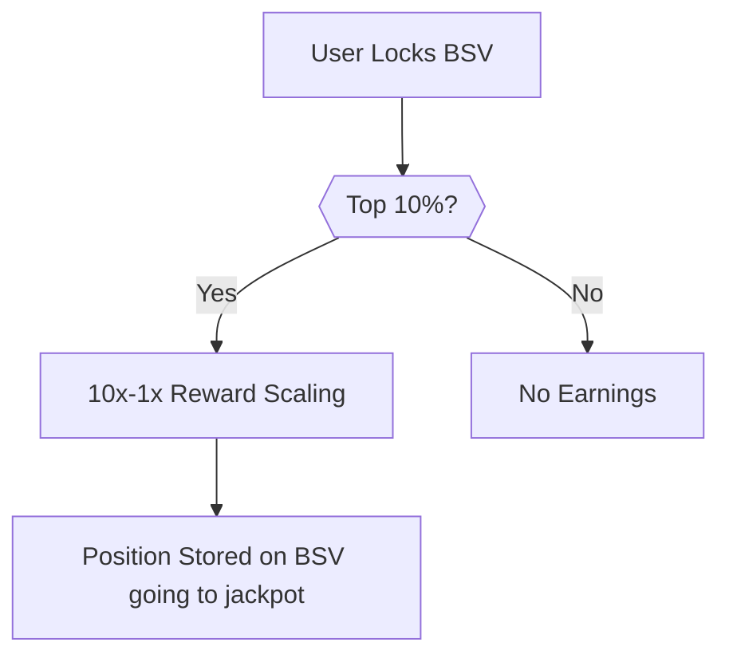
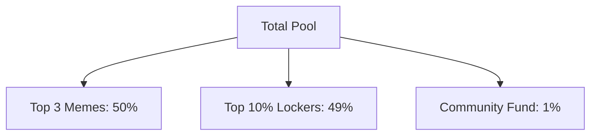
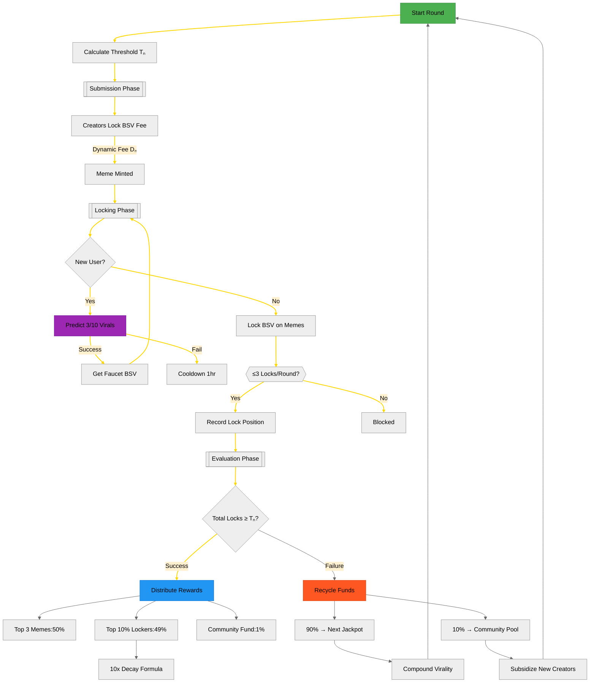

# Memepool - Decentralizing Truth Through Viral Prediction Markets

Memepool merges AI-generated 3D memes with BSV blockchain mechanics to create self-sustaining viral economies. Creators earn through dynamic micropayments while viewers gain stake in viral success through recycled rewards - turning both successes and failures into value.

Memepool merges AI-generated 3D memes with Bitcoin SV's blockchain to forge self-sustaining truth economies. Creators monetize truth through dynamic micropayments while viewers gain financial stakes in verifiable reality, with recycled rewards ensuring failed narratives fund future truth bombs.

The system operates as a viral prediction market. Successful memes distribute BSV rewards to creators and engaged viewers from a shared pool. Unsuccessful attempts contribute 90% of their remaining value to future rounds through an automated jackpot system. This creates compounding opportunities where even dormant memes fund new viral cycles.

Traditional platforms amplify state/corporate narratives through centralized algorithms. Memepool inverts this via provably neutral mechanics:


| Metric                  | Memepool                                      | Web2 Platforms                  |
|-------------------------|----------------------------------------------|---------------------------------|
| Early Adopter Bonus     | 10x rewards for first detectors             | Uniform distribution           |
| Value Recapture         | 90% failure recycling → Fuels counter-narratives | Permanent value loss         |
| Ownership              | Immutable on-chain provenance                | Shadowban-ready custody         |
| Censorship             | Impossible post-lock                         | Government-collaborative         |
| How Truth Gets Funded   | **AI-Powered Dissent**: Creators deploy 3D meme "startups" mocking propaganda/hypocrisy<br>**Stake-to-Viral**: Users lock BSV on memes they believe will destabilize mainstream narratives<br>**Reality Dividends**:<br>- Success: Top 3 memes + early lockers split 99% pool (10x reward decay)<br>- Failure: 90% BSV jackpots next round → Weaponizing loser propaganda | N/A |


### How it works
- Anonymous Submissions: No influencer advantage - AI memes stand on merit
- Truth Oracles: Locking BSV acts as economic proof-of-reality
- Hyperbitcoinization Trigger: Regimes attempting manipulation must buy BSV → Increasing its value → Funding more dissent


- Phase 1: User submits "AI Comparison: Politician X's 2021 vs 2024 Statements"
- Phase 2: Early lockers profit 10x when hypocrisy meme trends
- Phase 3: Failed memes fund next round's counter-narrative

Here's the enhanced section with security upgrades integrated natively:

## Block Round Lifecycle  
*A 10-minute competitive window where memes battle for virality through collective locking:*

### 1. **Pre-Round Threshold Adjustment**  
Before each round begins:  
```math
Tₙ = 0.5T_{prev} + 0.5\left(\text{trimmed\_mean}\left(S_{last12}\right)\right)
```
Where:

- S_last12 = Total BSV locked in previous 12 blocks
- trimmed_mean = Average after removing top/bottom 10% outliers
- Auto-adjusts with attack-resistant smoothing:
```math
if ∣Sk​−μ∣>3σ:Sk​=min(Sk​,μ+σ)
```

2. Submission Phase
Anonymous creators pay non-linear ZK fees to participate:
```typescript
// Quantum-resistant ZK Address Generation
function generateZKAddress(pubKey: string): string {
  const nonce = crypto.randomBytes(32);
  return crypto.createHash('sha3-512')
    .update(pubKey + nonce)
    .digest('hex');
}

// Non-linear fee calculation with attack damping
function getLockDifficulty(threshold: number): number {
  const base = 0.000004 * Math.pow(threshold, 1.5); // Increased exponent
  let fee = base;
  
  // Quadratic surcharge for threshold spikes
  if (threshold > 1000) { // 1000 BSV threshold
    const excess = threshold - 1000;
    fee += 0.00000002 * Math.pow(excess, 2);
  }
  
  return Math.max(0.01, fee);
}

// ZK Meme Submission
async function submitMeme(zkAddress: string, memeData: string) {
  const currentThreshold = await getTrimmedThreshold();
  const fee = getLockDifficulty(currentThreshold);
  
  // ZK Payment Protocol
  const tx = await bsv.sendPayment({
    from: zkAddress, // Burnable address
    to: MEMEPOOL_ADDRESS,
    amount: fee,
    opReturn: [
      'MEME', 
      crypto.createHash('sha256').update(memeData).digest('hex')
    ]
  });
  
  // Immutable anchoring via BSV
  storeMeme(
    memeData, 
    tx.id,
    bsval.OP_RETURN.lookup(tx.id) // Permanent on-chain reference
  );
}
```

Anti-Manipulation Fee Structure
```math
Dₙ = \begin{cases} 0.000004Tₙ^{1.5} + 0.00000002(Tₙ-1000)^2 & \text{if } Tₙ > 1000 \\ \max(\\$0.01,\ 0.000004Tₙ^{1.5}) & \text{otherwise} \end{cases}
```
Example Flow:

- Block 150 starts with trimmed Tₙ = 950 BSV (outliers removed)
- Check quadratic condition: 950 < 1000 → No surcharge
- Dₙ = max($0.01, 0.000004*950^1.5) = $0.41
- Creator submits through ZK address:
```bash
7a3b8f...d91e → MEMEPOOL_ADDRESS (0.41 BSV)
OP_RETURN: MEME|sha256(memeData)
```
- Meme anchored permanently via BSV transaction

### 3. **Locking Phase**  
*New users earn starter BSV by predicting 3/10 viral memes correctly, unlocking a faucet pass to either create content or grind more predictions – so no BSV needed to start.*

**Onboarding Flow**:  



  *Participants lock BSV to signal belief in a meme's virality while securing their reward position. Locking BSV acts as a prediction that the meme will hit its threshold*

```typescript
const MAX_LOCKS = 3; // Per user per round

const registerLock = (memeId: string, user: string) => {
  const locks = getUserLocksThisRound(user);
  if (locks >= MAX_LOCKS) {
    throw Error("Max 3 locks/round");
  }
  
  const globalPos = getChainLockCount() + 1;
  writeOrdinal(globalPos); // BSV timestamp
  trackParticipation(user); 
};
```




### 4. **Termination & Payout**  
**Success (S ≥ Tₙ):**  


**New Reward Formula (10x Decay):**  
```math
Rᵥ = \frac{0.49\text{Pool}}{10N} \times \left(11 - \frac{10\text{LockPos}}{N}\right)
```
Where:  
- `N` = Total participants in round  
- Only top 10% (0.1N) qualify  
- First locker gets 10x last qualifier:  
  ```math
  \text{First Reward} = 10 \times \text{Last Qualifier Reward}
  ```

**Example**: 1000 participants (top 100 rewarded):  
- Position 1: `(11 - 10/1000) × 0.49/1000 ≈ 0.00539 BSV`  
- Position 100: `(11 - 1000/1000) × 0.49/1000 ≈ 0.00049 BSV`  
- Exact 10x difference maintained


**Failure (S < Tₙ):**  
- 90% → Next jackpot  
- 10% → Community fund  

## 🧮 Key Formulas

**1. Adaptive Threshold**

```math
T_{n+1} = 0.7T_n + 0.3\left(\frac{1}{12}\sum_{k=1}^{12} S_{n-k}\right)
```

**2. Lock Difficulty**  
```math
D_{n+1} = \begin{cases} 
0.000004T_{n+1}^{1.2} & \text{if ≥ \$0.01} \\
\$0.01 & \text{floor}
\end{cases}
```

**3. Reward Distribution**  
```math
Rᵥ = \frac{0.49\text{Pool}}{\sum_{k=1}^{N}\frac{1}{\sqrt{k}}} \times \frac{1}{\sqrt{\text{LockPos}}}
```

**4. Qualification & Decay**:  
```math
\text{Qualified} = \begin{cases} 
1 & \text{if LockPos ≤ 0.1N} \\
0 & \text{otherwise}
\end{cases}
```

**5. Decaying Multipliers**:  
```math
\text{Multiplier} = 11 - \frac{10\text{LockPos}}{N}
```
---

Here's a comprehensive Mermaid diagram capturing Memepool's full lifecycle:


