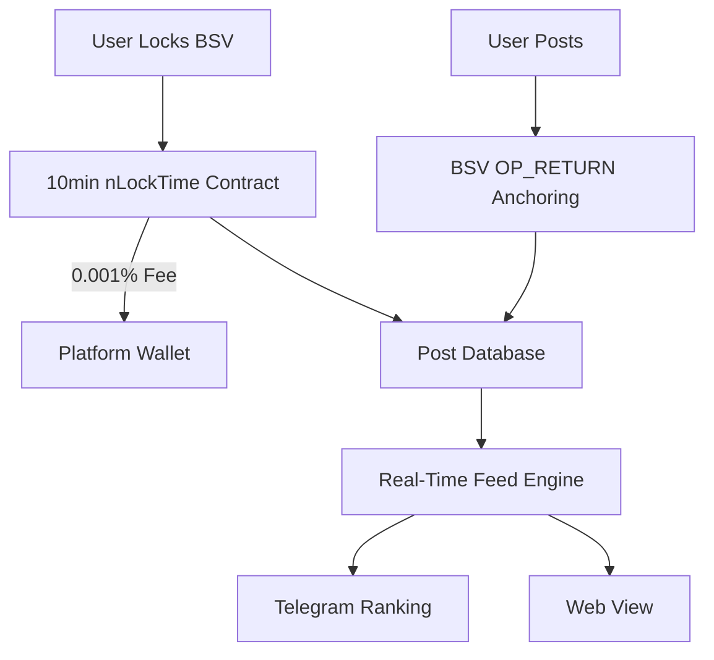

# Clarion - Decentralized Truth Through Economic Signaling

Clarion leverages Bitcoin SV's nLockTime to create a real-time barometer of societal value. Users anonymously lock BSV to amplify information they deem critical, creating a self-regulating feed ranked purely by economic conviction. The platform takes 0.001% of each lock as its sole fee.

## How It Works

### Core Mechanics
1. **Post**: Submit text/URL via BSV transaction with OP_RETURN
2. **Lock**: Users lock BSV for 10min to boost posts (0.001% fee)
3. **Dynamic Feed**: Real-time ranking based on currently locked BSV
4. **Telegram Integration**: Top 100 posts streamed with lock amounts



## Architecture
1. Blockchain Layer

Posting: OP_RETURN with schema:
OP_RETURN "CLARION" <post_id> <content_hash>


Locking: P2SH address with:
```typescript
contract TimeLock {
  int lockDuration;
  public function unlock(int currentTime) {
    require(currentTime >= this.lockTime + lockDuration);
  }
}
```

2. Incentive Structure

Creators: Posts rise based on locked BSV sum
Lockers: Signal value without KYC. Locked BSV returned after 10min
Platform: 0.001% fee funds infrastructure

3. Feed Algorithm
```typescript
def update_feed():
current_time = get_chain_time()
active_locks = filter(lambda x: x.lock_time + 10min <= current_time, all_locks)
post_scores = defaultdict(float)
for lock in active_locks:
    post_scores[lock.post_id] += lock.amount

sorted_posts = sorted(post_scores.items(), key=lambda x: -x[1])
broadcast(sorted_posts[:100])
```

Implementation Roadmap


BSV Core

Fork hodlocker for nLockTime base
Implement sCrypt timelock contracts


Telegram Bot
async def send_ranking():
while True:
posts = get_top_100()
text = "Clarion Top Posts:\n\n" + "\n".join(
[f"{i+1}. {p.content[:50]} (⛓️ {p.locked} BSV)"
for i, p in enumerate(posts)])
await bot.send_message(CHANNEL_ID, text)
sleep(300)  # Update every 5min


Dynamic Adjustment

Lock window auto-scales based on network activity:

new_window = max(10min, 0.8 * avg_last_6_blocks)


Why It Disrupts Fake News


Metric
Clarion
Traditional Media


Amplification
$1 lock = 1 vote
Free virality


Accountability
Locked BSV proves conviction
Anonymous shares


Time Horizon
10min rolling window
24hr news cycle


Censorship
Immutable BSV anchors
Centralized takedowns


Example Flow:

User posts "BREAKING: Conflict Resolution in Region X"
50 users lock 0.5 BSV each (25 BSV total)
Post trends #1 on Telegram feed
After 10min, 24.975 BSV returned (0.025 BSV fee)
Feed updates with new locking data

Clarion creates a financial truth serum - where society's real priorities surface through provable economic action, not algorithmic manipulation.
