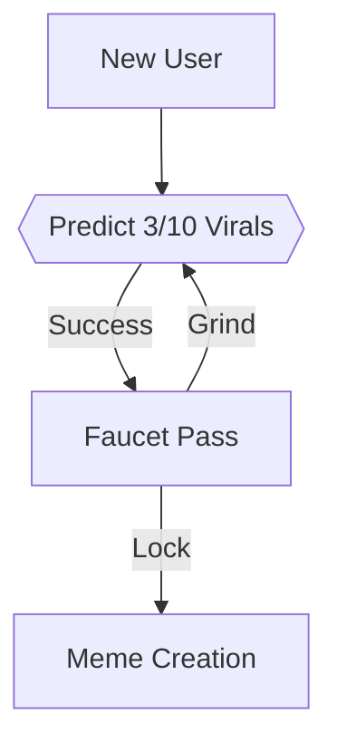
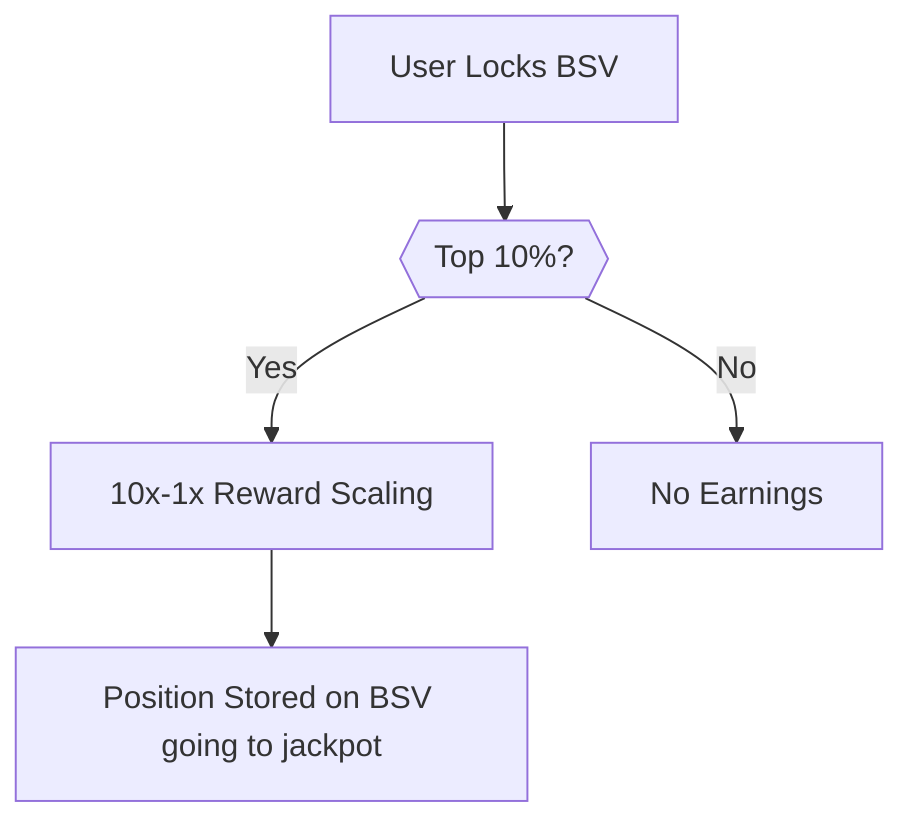
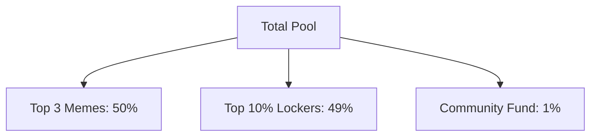
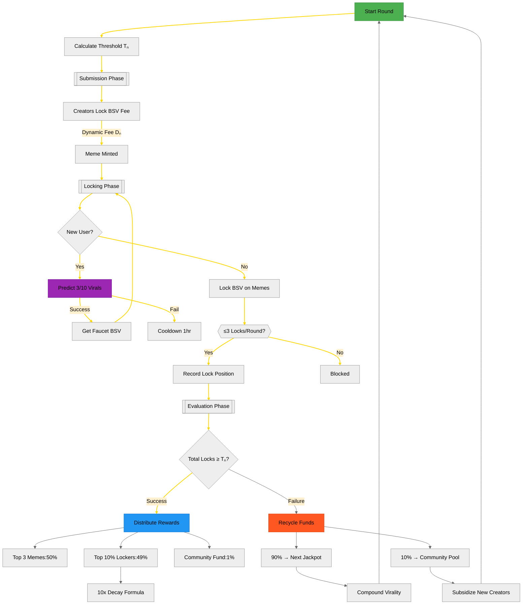

 Memepool Documentation  

Memepool merges AI-generated 3D memes with BSV blockchain mechanics to create self-sustaining viral economies. Creators earn through dynamic micropayments while viewers gain stake in viral success through **recycled rewards** - turning both successes and failures into value.

Traditional platforms extract value from viral content. Memepool inverts this model using Bitcoin SV's blockchain to transform every interaction into owned equity. Creators launch AI-powered 3D meme "startups" where community engagement directly translates to BSV rewards through transparent, algorithmically governed incentives.

The system operates as a viral prediction market. Successful memes distribute BSV rewards to creators and engaged viewers from a shared pool. Unsuccessful attempts contribute 90% of their remaining value to future rounds through an automated jackpot system. This creates compounding opportunities where even dormant memes fund new viral cycles.

Participants earn rewards if they're in the **top 10%** of lockers, with a guaranteed 10x reward multiplier between first and last positions.


| Metric          | Memepool                          | Web2 Platforms       |  
|-----------------|-----------------------------------|----------------------|  
| **Early Adopter Bonus** | 10x rewards for first detectors | Uniform distribution |  
| **Value Recapture** | 90% failure recycling           | Permanent value loss |  
| **Ownership**     | On-chain provenance              | Platform custody     |  

Memepool weaponizes viral content markets to become humanity's financial conscience. By merging AI-generated 3D memes with Bitcoin SV's immutable ledger, we create an anonymous information battlefield where truth wins through economic proof, not algorithmic manipulation.

Death to Fake News, Psyops & Thought Control
Traditional Web2 platforms:
❌ Promote rage-bait through engagement algorithms
❌ Allow free amplification of government/corporate propaganda
❌ Keep users trapped in AI-curated echo chambers

Memepool inverts this through Proof-of-Truth Economics:

✅ Anonymous Submissions - No profiles, followers, or influencer advantages
✅ BSV-Backed Virality - Only content with locked economic conviction trends
✅ Failure Recycling - 90% of failed propaganda attempts fund future truth bombs

graph LR
    A[Fake News] -->|Costs Nothing| B[Floods Web2]
    C[Memepool Truth] -->|Requires Locked BSV| D[Financial Filter]
    D -->|No Conviction| E[Garbage Dies]
    D -->|Mass Locking| F[Truth Trends]
    F --> G[Mainstream Media Forced to Report]
    

## Block Round Lifecycle  
*A 10-minute competitive window where memes battle for virality through collective locking:*

### 1. **Pre-Round Threshold Adjustment**  
Before each round begins:  
```math
Tₙ = 0.7T_{prev} + 0.3\left(\frac{1}{12}\sum_{k=1}^{12} S_{last12}\right)
```  
Where:  
- `S_last12` = Total BSV locked in previous 12 blocks  
- Threshold auto-adjusts even if no new activity occurs  

### 2. Submission Phase  
*Creators pay a dynamic fee to participate - ensuring anti-spam while aligning costs with network activity.*

```typescript
// Gets current lock difficulty
function getLockDifficulty(threshold: number): number {
  const calculated = 0.000004 * Math.pow(threshold, 1.2);
  return Math.max(0.01, calculated); // $0.01 floor
}

// Creator submits meme
async function submitMeme(creator: string, memeData: string) {
  const currentThreshold = await getCurrentThreshold();
  const fee = getLockDifficulty(currentThreshold);
  
  // Lock BSV to blockchain
  const tx = await bsv.sendPayment({
    from: creator,
    to: MEMEPOOL_ADDRESS,
    amount: fee
  });
  
  // Store meme with locked TX ID
  storeMeme(memeData, tx.id); 
}
```

**Fixed Per-Block Fee**  
   - All creators pay same `Dₙ` during a block round  
   - Formula:  
     ```math
     Dₙ = \max(\$0.01,\ 0.000004Tₙ^{1.2})
     ```  
     Where `Tₙ` = pre-calculated threshold from last 12 blocks  

**Example Flow**:  
1. Block 150 starts with Tₙ = 1,000 BSV (from prior 12 blocks)  
2. Dₙ = max($0.01, 0.000004*1000^1.2) = $0.38  
3. All creators in Block 150 pay $0.38 to submit memes  
4. Paid BSV locks to memepool address become redeemable if meme goes viral  


### 3. **Locking Phase**  
*New users earn starter BSV by predicting 3/10 viral memes correctly, unlocking a faucet pass to either create content or grind more predictions – so no BSV needed to start.*

**Onboarding Flow**:  



  *Participants lock BSV to signal belief in a meme's virality while securing their reward position. Locking BSV acts as a prediction that the meme will hit its threshold*

```typescript
const MAX_LOCKS = 3; // Per user per round

const registerLock = (memeId: string, user: string) => {
  const locks = getUserLocksThisRound(user);
  if (locks >= MAX_LOCKS) {
    throw Error("Max 3 locks/round");
  }
  
  const globalPos = getChainLockCount() + 1;
  writeOrdinal(globalPos); // BSV timestamp
  trackParticipation(user); 
};
```




### 4. **Termination & Payout**  
**Success (S ≥ Tₙ):**  


**New Reward Formula (10x Decay):**  
```math
Rᵥ = \frac{0.49\text{Pool}}{10N} \times \left(11 - \frac{10\text{LockPos}}{N}\right)
```
Where:  
- `N` = Total participants in round  
- Only top 10% (0.1N) qualify  
- First locker gets 10x last qualifier:  
  ```math
  \text{First Reward} = 10 \times \text{Last Qualifier Reward}
  ```

**Example**: 1000 participants (top 100 rewarded):  
- Position 1: `(11 - 10/1000) × 0.49/1000 ≈ 0.00539 BSV`  
- Position 100: `(11 - 1000/1000) × 0.49/1000 ≈ 0.00049 BSV`  
- Exact 10x difference maintained


**Failure (S < Tₙ):**  
- 90% → Next jackpot  
- 10% → Community fund  

## 🧮 Key Formulas

**1. Adaptive Threshold**

```math
T_{n+1} = 0.7T_n + 0.3\left(\frac{1}{12}\sum_{k=1}^{12} S_{n-k}\right)
```

**2. Lock Difficulty**  
```math
D_{n+1} = \begin{cases} 
0.000004T_{n+1}^{1.2} & \text{if ≥ \$0.01} \\
\$0.01 & \text{floor}
\end{cases}
```

**3. Reward Distribution**  
```math
Rᵥ = \frac{0.49\text{Pool}}{\sum_{k=1}^{N}\frac{1}{\sqrt{k}}} \times \frac{1}{\sqrt{\text{LockPos}}}
```

**4. Qualification & Decay**:  
```math
\text{Qualified} = \begin{cases} 
1 & \text{if LockPos ≤ 0.1N} \\
0 & \text{otherwise}
\end{cases}
```

**5. Decaying Multipliers**:  
```math
\text{Multiplier} = 11 - \frac{10\text{LockPos}}{N}
```
---

Here's a comprehensive Mermaid diagram capturing Memepool's full lifecycle:


