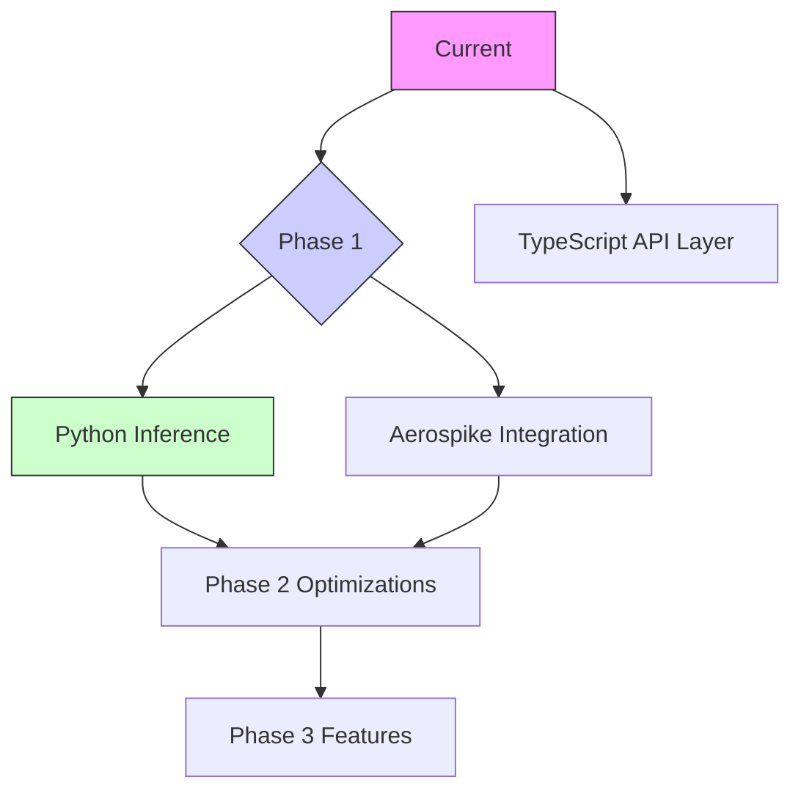

# AI Video Generation Architecture Roadmap

## Architecture Goals
1. **High Efficiency**: Process 1000+ RPM (requests per minute) with <500ms latency
2. **Cost Optimization**: $0.001 per video generation at scale
3. **Flexibility**: Hot-swappable AI models without downtime
4. **Reliability**: 99.99% uptime with automatic failover
5. **Scalability**: Linear scaling with demand using Kubernetes

## Key Technology Choices
- **Core AI**: Python (PyTorch/TensorRT) for maximum GPU utilization
- **Caching**: Aerospike (5x faster than Redis for large binary data)
- **Orchestration**: Kubernetes with GPU-aware scheduling
- **Metrics**: Prometheus + Grafana with custom exporters
- **CI/CD**: GitOps with ArgoCD for model updates

## Phase 1: Core Infrastructure (Current Focus)
- [x] Base API service in TypeScript
- [x] Cloud service integration (Stability AI)
- [ ] **Python Inference Microservice**
  - [ ] Dockerized SVD implementation
  - [ ] gRPC interface for high-speed communication
  - [ ] Model warm-up system
- [ ] Aerospike Integration
  - [ ] Video cache layer
  - [ ] Request deduplication
  - [ ] Session state management

## Phase 2: Performance Optimization
- [ ] GPU Resource Pooling
  - [ ] NVIDIA MIG partitioning
  - [ ] Multi-model GPU sharing
  - [ ] Automatic precision scaling (FP16/FP8)
- [ ] Smart Batch Processing
  - [ ] Dynamic batch sizing
  - [ ] Priority queuing
  - [ ] Predictive pre-batching
- [ ] Aerospike Optimization
  - [ ] SSD-optimized video storage
  - [ ] Hybrid memory cache
  - [ ] Cross-datacenter replication

## Phase 3: Advanced Features
- [ ] Real-time Streaming
  - [ ] WebRTC preview streams
  - [ ] Frame-by-frame progressive rendering
  - [ ] Interactive parameter adjustment
- [ ] Style Transfer Engine
  - [ ] On-demand LoRA loading
  - [ ] Neural style mixing
  - [ ] Cross-model blending
- [ ] AI-Assisted Editing
  - [ ] Motion path prediction
  - [ ] Automatic frame interpolation
  - [ ] Smart upscaling

## Phase 4: Deployment & Monitoring
- [ ] Kubernetes Configuration
  - [ ] GPU autoscaling
  - [ ] Spot instance integration
  - [ ] Model-aware scheduling
- [ ] Observability Stack
  - [ ] Generation cost tracking
  - [ ] Quality metrics (FVD, PSNR)
  - [ ] Anomaly detection
- [ ] Security
  - [ ] Model watermarking
  - [ ] NSFW filtering
  - [ ] Rate limiting

## Migration Strategy



1. **Stage 1**: Hybrid Operation
   - Maintain TypeScript interface
   - Route requests to Python service via gRPC
   - Dual-write cache to Aerospike and Redis
   
2. **Stage 2**: Performance Cutover
   - Migrate all caching to Aerospike
   - Enable GPU pooling
   - Decommission legacy TypeScript AI code

3. **Stage 3**: Full Optimization
   - Implement model registry
   - Activate automatic batch processing
   - Enable cross-zone replication

## Aerospike Advantage

| Metric          | Aerospike          | Redis           |
|-----------------|--------------------|-----------------|
| **Throughput**  | 1M ops/sec/node    | 100K ops/sec/node |
| **Latency**     | <1ms P99           | 2-5ms P99       |
| **Data Size**   | PB-scale           | TB-scale        |
| **Cost/GB**     | $0.25              | $1.50           |
| **Durability**  | ACID transactions  | Eventually consistent |

## Performance Targets

```math
\text{Throughput} = \frac{\text{GPUs} \times 8\text{(batch size)} \times 3600}{\text{Generation Time (s)}}
```

Example for 10 GPUs:
```python
10 * 8 * 3600 / 2.5 = 115,200 generations/hour
```

## Next Steps
1. Implement Python service Docker setup
2. Create Aerospike schema for video caching
3. Develop gRPC interface between TS and Python
4. Build GPU monitoring dashboard
5. Set up CI/CD pipeline for model updates 